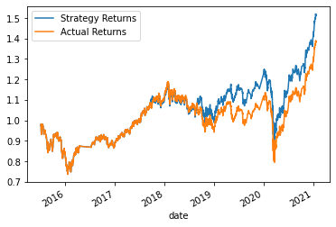
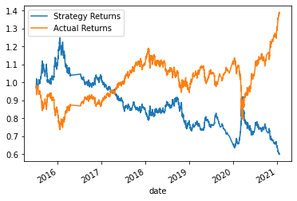

# Algorithmic_Trading_Bot

## Technologies
**pandas via Jupyter notebook
**SKlearn
**numpy
**maitploy

## Usage Instructions

From Jupyter notebook add all the code and then restart the Kermal and run all the cells.  This code uses the following dependencies:
import pandas as pd
import numpy as np
from pathlib import Path
import hvplot.pandas
import matplotlib.pyplot as plt
from sklearn import svm
from sklearn.preprocessing import StandardScaler
from pandas.tseries.offsets import DateOffset
from sklearn.metrics import classification_report

## Project Inputs and Design

A OHLCV spreadsheet dataset was used with MSCI Index data.  Trading signals were established with SMA values to determine when to buy/sell/hold.  SKlearn was used to support SVM learning methods and then the data was fit using linear regression to make predictions.  The data was then ploted to make a visual representation of actual returns vs strategic returns.

## Results

Here is a chart of the Baseline Model plot:

Baseline just represents the first trading strategy that does not use any algorithms and generates a buy/sell signal when the prior return was positive/negative.  This was the straegy that performed the worst.  

SVC classifier model used two input parameters which are a 4-day and a 100-day moving average price.  Thsi strategy outperfomred the Actual Return and was effective at identifying positive return trading days with a 0.98 recall.

Using a Decision Tree Classifier Model - The results were not as good, indicated that this strategy is not as effective.  However, this model still performed better then the baseline model which did not use any algorithm.  

## Contributors
Project Designor:  Michael Mikelic

Contact information : mikelicmichael@gmail.com

## License Inform
MIT License